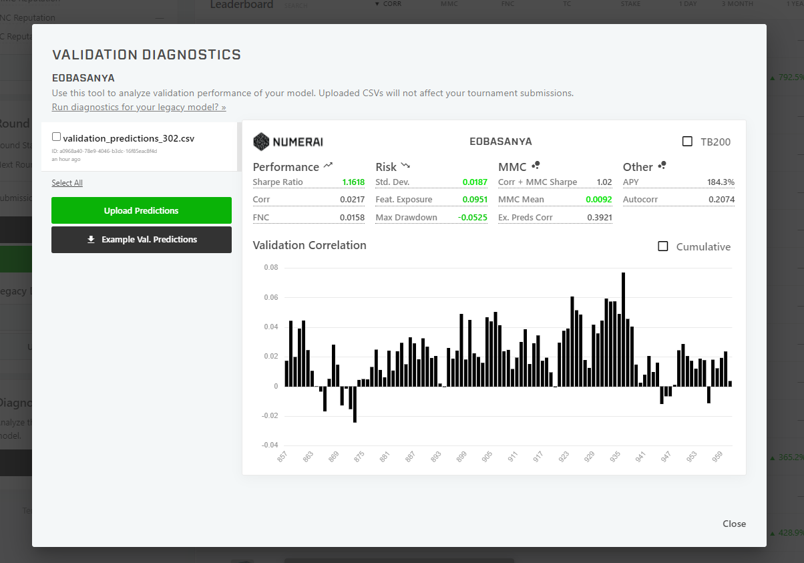

# Professional Portfolio #

## Welcome to My Portfolio! ##

My name is Elijah Obasanya, and my background is in Investment Banking. I cover equities and incorporate fundamental analysis on various stocks for numerous sectors to conduct ad hoc research and determine price targets. This portfolio builds on this experience into quantitative development on the equities market, its data cleaning and analytics process, and tops off with sophisticated trading algorithms including incorporating neural networks to train models. This will also be done on cryptocurrencies as well, and there will be significan blockchain related projects included on those projects. 

I aim to utilize these skills in the realms of quantitative development, and roles relating to the development of trading algorithms for equities, derivatives, other securities and cryptocurrencies as well! I am extremely excited about the future that neural networks and the blockchain has on investing and finance overall, which has been the catalyst for my interest in fintech. 

An example of the beginning of a model can be seen here. 
```
model = Sequential

model.add(LSTM(units=50, return_sequences=True, input_shape=(x_train.shape[1], 1)))
model.add(Dropout(0.2))
model.add(LSTM(units=50, return_sequences=True))
model.add(Dropout(0.2))
model.add(LSTM(units=50))
model.add(Dropout(0.2))
model.add(Dense(units=1)) #Prediction of the next closing price 

model.compile(optimizer='adam', loss='mean_squared_error')
model.fit(x_train, y_train, epochs=25, batch_size=32)  

```
An example of the resulting training data for a model on platform Numerai seen below. 

>

## Subfolders ##


---
[Code](https://github.com/eobasanya/Professional-Portfolio/tree/main/code)

---
[Data](https://github.com/eobasanya/Professional-Portfolio/tree/main/data)


If you have any additional questions on any of the projects i've worked on or if you would like to reach me personally, feel free to reach me at Elijah.Obasanya@gmail.com. Happy coding!  

## Table of Contents ##
WIP
